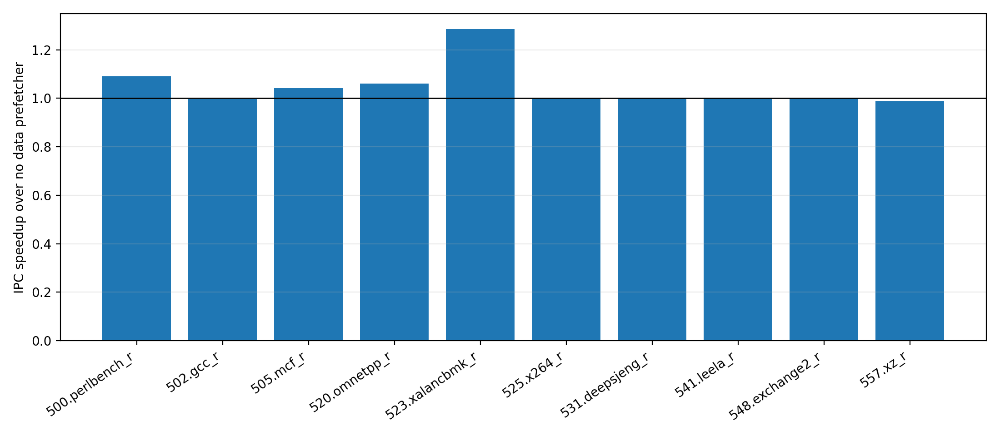

# Bingo Spatial Data Prefetcher in Scarab

Repository: https://github.com/jwmao1/cse220_project

## Abstract

This project implements Bingo, the HPCA 2019 spatial data prefetcher, in
Scarab. Bingo learns spatial footprints within 2 KiB memory regions and uses a
single pattern-history table (PHT) to balance coverage and accuracy. The
implementation is adapted from the public ChampSim reference code while using
Scarab's native prefetch queue, parameter, and statistics interfaces. On 10
course SPEC traces, Bingo improves geometric-mean IPC by 4.37% over a
no-data-prefetch baseline and reduces unified L1 demand misses by 63.73%.

## Technique

Bingo records the first access to a region in a 64-entry filter table. A second
distinct block access promotes the region to a 128-entry accumulation table,
where the footprint is collected. When the region generation ends, Bingo
trains a 16K-entry, 16-way PHT. The lookup first attempts a precise PC+Address
match. If it misses, entries with the same PC+Offset event vote on the predicted
footprint using the upstream 20% threshold. This fallback improves coverage
without maintaining two independent pattern tables.

## Scarab Integration

The public Bingo code is a ChampSim LLC prefetcher. Scarab exposes a unified
L1 path above its private dcache, so this implementation attaches Bingo to that
unified L1 path. Demand accesses call the Bingo access hook and predictions are
submitted through `pref_addto_ul1req_queue_set()`. A new unified-cache eviction
callback ends region generations and trains the PHT. Configuration parameters
and counters are registered with Scarab's existing generated parameter and
statistics systems.

The implementation keeps the reference defaults: 2 KiB regions, 64 filter
entries, 128 accumulation entries, 16K PHT entries, 16 PHT ways, 16-bit PC
signatures, and a 20% voting threshold. The baseline disables all data
prefetchers. The Bingo configuration changes only `--pref_bingo_on`.

## Methodology

The evaluation uses the 10 SPEC traces provided by the course Docker image.
Each workload is simulated twice, once with no data prefetcher and once with
Bingo. Each run uses a 20M-instruction trace window with a 10M-instruction
full-warmup interval. The scripts preserve raw Scarab output, parse the regular
post-warmup statistics CSV files, and generate the IPC-speedup plot below.

## Results

The geometric-mean IPC speedup is 1.0437. The strongest improvement is
`523.xalancbmk_r` at 1.2849, followed by `500.perlbench_r` at 1.0916 and
`520.omnetpp_r` at 1.0604. Two workloads regress slightly:
`502.gcc_r` reaches 0.9975 and `557.xz_r` reaches 0.9868.

Across all workloads, unified L1 demand misses fall from 633,345 to 229,697.
Bingo queues 1,067,480 prefetch requests, with no queue rejection in this
experiment. Scarab records 418,703 useful prefetch hits. The observed
hit-to-queued ratio is 39.22%; it is an implementation-level usefulness ratio,
not a direct substitute for the paper's accuracy metric.

## Limitations

This is a Scarab mechanism reproduction, not a bit-identical replay of the
paper's ChampSim experiments. The cache attachment point, simulator timing
model, trace set, and simulation length differ from the paper. The current
Windows Scarab checkout also expects newer architecture-register trace
metadata, while the course traces use the older Lab 2 format. The formal
evaluation therefore runs the same Bingo source changes on the
Lab-2-compatible course Scarab base inside Docker.

## Reproduction

Run `scripts/run_bingo_spec.py` for the two-configuration SPEC experiment and
`scripts/plot_bingo_results.py` for the metrics CSV and figure. Full commands,
paths, build instructions, and generated artifacts are documented in
`README_BINGO.md`.
